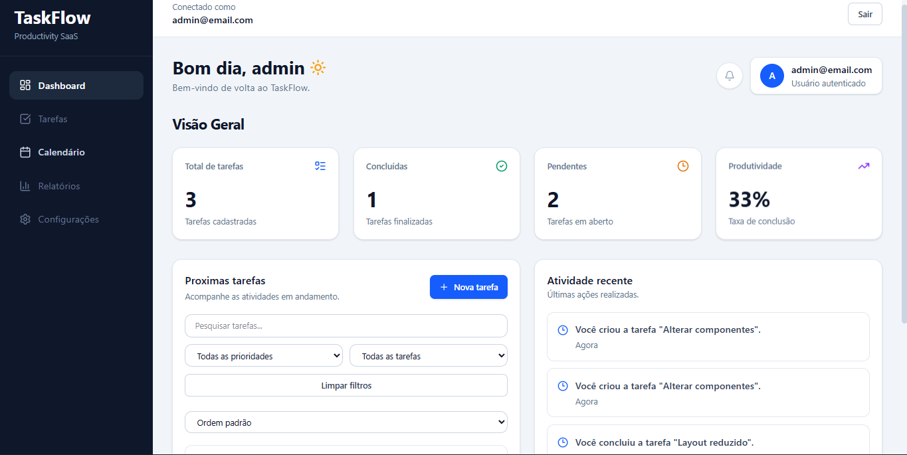

# 🚀 TaskFlow

O **TaskFlow** é uma aplicação web de gerenciamento de tarefas inspirada em produtos SaaS reais, desenvolvida com foco em boas práticas de Front-End, organização de código, autenticação real e persistência de dados.

Este projeto faz parte da construção do meu portfólio como Desenvolvedor Front-End.

---

## 📸 Preview



### 🔗 Links

- Repositório: [GitHub](https://github.com/Britou/taskflow)
- Deploy: em breve

---

## ✨ Visão geral

O TaskFlow permite que usuários cadastrem, organizem, editem, concluam e acompanhem suas tarefas em um dashboard responsivo.

A aplicação conta com autenticação real via Firebase, dados persistidos no Cloud Firestore, rotas protegidas, histórico de atividades e isolamento de informações por usuário autenticado.

---

## 🧰 Tecnologias utilizadas

- React
- TypeScript
- Vite
- Tailwind CSS
- React Router
- Firebase Authentication
- Cloud Firestore
- Context API
- Hooks personalizados
- Lucide React
- Git e GitHub

---

## 🔐 Funcionalidades implementadas

✔ Cadastro e login com Firebase Authentication  
✔ Logout com redirecionamento  
✔ Rotas públicas e protegidas  
✔ CRUD completo de tarefas  
✔ Persistência de dados no Cloud Firestore  
✔ Isolamento de tarefas por usuário autenticado  
✔ Histórico de atividades por usuário  
✔ Métricas dinâmicas no dashboard  
✔ Busca, filtros e ordenação de tarefas  
✔ Prioridade, descrição e data de vencimento  
✔ Indicadores visuais de prazo  
✔ Página de calendário com tarefas reais  
✔ Estados de loading, erro e empty state  
✔ Layout responsivo para desktop e mobile  

---

## 🧠 Destaques técnicos

- Autenticação real com Firebase Authentication
- Dados protegidos por usuário no Cloud Firestore
- Regras de segurança configuradas no Firestore
- Separação entre contexto, hooks, services, types e componentes
- Estados globais organizados com Context API
- Manipulação de campos opcionais no Firestore
- Interface responsiva com Tailwind CSS
- Validação contínua com build e lint

---

## 🧱 Organização do projeto

O projeto foi estruturado com separação de responsabilidades para facilitar manutenção e evolução:

- `components`: componentes visuais da aplicação
- `pages`: páginas principais
- `layouts`: estrutura das áreas protegidas
- `contexts`: estados globais da aplicação
- `hooks`: hooks personalizados
- `services`: integração com Firebase e Firestore
- `types`: tipagens compartilhadas
- `ui`: componentes base reutilizáveis

---

## 🎯 Objetivo do projeto

Simular o desenvolvimento de uma aplicação real, aplicando:

- Boas práticas de arquitetura Front-End
- Componentização
- Tipagem com TypeScript
- Autenticação e banco de dados real
- Rotas protegidas
- Persistência e isolamento de dados
- Responsividade
- Versionamento profissional com Git
- Evolução incremental de features

---

## ▶️ Como rodar o projeto

```bash
# Instalar dependências
npm install

# Rodar em ambiente de desenvolvimento
npm run dev

# Gerar build de produção
npm run build

# Executar lint
npm run lint
```

---

## 📌 Status do projeto

🚧 Em desenvolvimento ativo.

### Próximas melhorias planejadas

- Deploy da aplicação
- GIF demonstrativo do fluxo principal
- Melhorias finais de UI/UX
- Revisão visual para GitHub e LinkedIn

---

## 👨‍💻 Autor

Desenvolvido por **Raphael Alves Brito**.